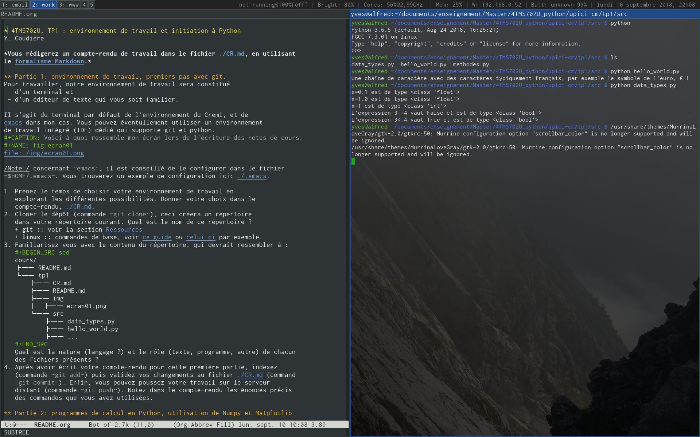

# Table des matières

1.  [4TMS702U, TP1: environnement de travail et initiation à Python](#org58772a3)
    1.  [Séance 1, mardi 11 septembre 2018](#org3b596a8)
    2.  [Séance 2, mardi 18septembre 2018](#org150102a)
    3.  [Partie 1: environnement de travail, premiers pas avec git.](#org0dda037)
    4.  [Partie 2: programmes de calcul en Python, utilisation de Numpy et Matplotlib](#org22293e4)

# 4TMS702U, TP1: environnement de travail et initiation à Python

**Le compte-rendu ([./CR.md](./CR.md)) utilise le [formalisme Markdown](https://guides.github.com/features/mastering-markdown) de Github.**

## Séance 1, mardi 11 septembre 2018

-   Renvoyez moi le fichier CR.md par email (yves.coudiere@u-bordeaux.fr)
    aujourd'hui, mardi 11 septembre 2018. L'objectif est d'aller jusqu'à
    la fin de la question 1 de la partie 2.
-   Indiquer [TP1.1] avec vos noms et prénom dans le sujet du mail
-   Ne pas oublier de joindre aussi les fichiers (images par exemple) vers
    lesquelles le fichier .md pointe éventuellement.

\*Il n'est pas nécessaire d'aller au bout des questions, les dernières
questions ne sont là que pour les personnes qui sont déjà très à l'aise
en programmation.\*

## Séance 2, mardi 18septembre 2018

1.  Ouvrir un compte sur la plateforme github.com (sauf si vous en avez
    déjà un).
2.  Cliquer sur le lien envoyé par email, puis accepter l'invitation sur
    votre compte github, ce qui doit créer une copie du dépôt git
    contenant les notes de cours et le TP1.
3.  Vous pouvez maintenant cloner le dépôt.
4.  Avant de travailler avec git, il faut configurer votre nom et adresse
    email avec git config &#x2013;set user.name et git config &#x2013;set user.email.
5.  Recopier le compte rendu écrit la semaine dernière dans le fichier
    [CR.md](CR.md) du nouveau dépôt, puis valider les modifications (git add
    &#x2026; et git commit -m &#x2026;).
6.  Commencer le travail de la partie 2 ci-dessous. Pour répondre aux
    questions, vous devez utiliser le fichier [CR.md](CR.md).
    -   Un objectif de la séance est que vous documentiez l'historique des
        fichiers que vous ajoutez ou modifiez, notamment le fichier [CR.md](CR.md)
        (commandes git add et git commit).

**N'oubliez pas de pousser (git push) votre travail sur le serveur à la
fin de la séance.** C'est de cette manière que nous allons récupérer
votre travail et votre compte-rendu.

## Partie 1: environnement de travail, premiers pas avec git.

Pour travailler, notre environnement de travail sera constitué 

-   d'un terminal et
-   d'un éditeur de texte qui vous soit familier.

Il s'agit du terminal par défaut de l'environnement du Cremi, et de
[emacs](https://www.gnu.org/software/emacs) dans mon cas. Vous pouvez éventullement utiliser un environnement
de travail intégré (IDE) dédié qui supporte git et python.

 

*Note:* concernant `emacs`, il est conseillé de le configurer dans le fichier
`$HOME/.emacs`. Vous trouverez un exemple de configuration ici: [./.emacs](./.emacs).

1.  Prenez le temps de choisir votre environnement de travail en
    explorant les différentes possibilités. Donner votre choix dans le
    compte-rendu, [./CR.md](./CR.md).
2.  Cloner le dépôt (commande `git clone`), ceci créera un repertoire
    dans votre répertoire courant. Quel est le nom de ce répertoire ?
3.  Familiarisez vous avec le contenu du répertoire, qui devrait ressembler à :
    
        cours/
        ├── README.md
        └── tp1
            ├── CR.md
            ├── README.md
            ├── img
            │  ├── ecran01.png
            └── src
        	├── data_types.py
        	├── hello_world.py
        	├── ...
    
    Quel est la nature (langage ?) et le rôle (texte, programme, autre) de chacun
    des fichiers présents ?

## Partie 2: programmes de calcul en Python, utilisation de Numpy et Matplotlib

1.  À partir du programme existant, calculer le tableau des erreurs
    commises par la méthode d'Euler explicite pour l'équation y'(t) = 1-y
    avec y(0) = 5 pour t dans [0,1], en prenant des pas de temps h = 0.2
    0.1 0.05 0.025 0.0125 0.00625. 
    
    Donner le tableau des valeurs et tracer le graphe de l'erreur en
    fonction de h en échelle logarithmique. Ce graphe est appelé graphe
    de convergence.
2.  Reproduire cette étude pour l'équation y'(t) = 1-y^2, dont on sait
    calculer une solution exacte. On prendra t dans [0,1] et y(0) = 0
    puis y(0)=2.
3.  Reprendre l'analyse avec la méthode suivante (que l'on appelle
    méthode de Runge-Kutta 2 &#x2013; RK2) à la place de la méthode d'Euler:
    y\_{n+1} = y\_n + h\*f(t\_n+0.5\*h,y\_n+0.5\*f(y\_n)). Tracer les graphes de
    convergence des 2 méthodes sur la même figure (en échelle
    logarithmique). Quel commentaire peut-on faire ?
4.  Reprendre l'analyse avec la méthode y\_{n+1} = y\_{n-1} +
    2\*h\*f(t\_n,y\_n), appelée méthode du point milieu ou méthode
    saute-mouton. On calculera y\_1 par la méthode RK2.
5.  On souhaite utiliser la méthode y\_{n+1} = y\_n + 0.5\*h\*( f(t\_n,y\_n) +
    f(t\_{n+1},y\_{n+1}), appelée méthode du trapèze. Il faut donc résoudre
    une équation non linéaire. 
    
    Pour cela, on peut calculer y\_{n+1} comme la limite de la suite
    itérative y\_{n+1,p+1} = y\_n + 0.5\*h\*( f(t\_n,y\_n) +
    f(t\_{n+1},y\_{n+1,p}) avec par exemple y\_{n+1,0} calculé par la
    méthode d'Euler explicite. En pratique, on s'aperçoit qu'il est
    possible de ne faire qu'une seule itération de cette suite. On tombe
    alors sur la méthode suivante, dite de prédiction-correction: y\_\* =
    y\_n + h\*f(t\_n,y\_n) [prédiction], puis y\_{n+1} = y\_n + 0.5\*h\*(
    f(t\_n,y\_n) + f(t\_{n+1},y\_\*) ) [correction]. 
    
    On peut aussi utiliser la méthode de Newton (par exemple telle
    qu'elle existe dans le module `scipy.optimize`) pour calculer une
    approximation de la solution précise de l'équation non-linéaire
    initiale.
    
    Programmer ces deux méthodes et les tester sur l'équation de la
    question 2. Refaire les graphes de convergence et comparer avec les
    méthodes précédentes.
6.  Nous disposons maintenant de 4 méthodes (si l'on ne conserve que la
    verzsion prédiction-ocrrection de la question 5). Dans cette question
    nous souhaitons les comparer pour la résolution de l'équation y'(t) =
    a\*y(t) + (1-a)\*cos(t) - (1+a)\*sin(t), avec y(0)=1. Quel que soit a,
    la solution exacte de ce problème de Cauchy est y(t) = sin(t)+cos(t).
    
    Comparer les erreurs commise par les différentes méthodes pour a=-1,
    -10, -50 avec h=0.5, 0.1, 0.01 et en cherchant une solution approchée
    sur [0,5].
7.  On souhaite maintenant pouvoir résoudre des systèmes d'équations
    différentielles, c'est à dire que y peut être un vecteur de dimension
    finie m d'inconnues, et f(t,y) une fonction de RxR^m dans
    R^m. Transformer le module [src/methodes.py](src/methodes.py) de telle sorte que chaque
    méthode programmée puisse prendre en entrée une telle fonction, et
    renvoyer un tableau solution de taille m x (1+N) (où N est le nombre
    de pas de temps).
    
    Tester votre module en vérifiant la résolution du système linéaire y'
    = Ay avec A = diag(-1,-2), dont la solution exacte est y(t) =
    exp(At)\*y(0). On prendre par exemple y(0)=(1,1) et T=1.

